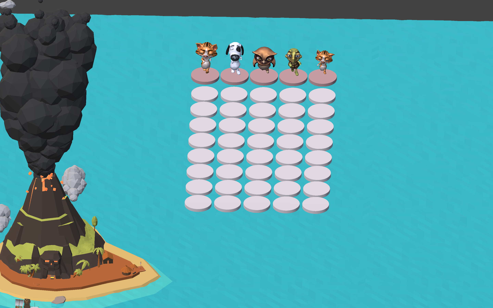
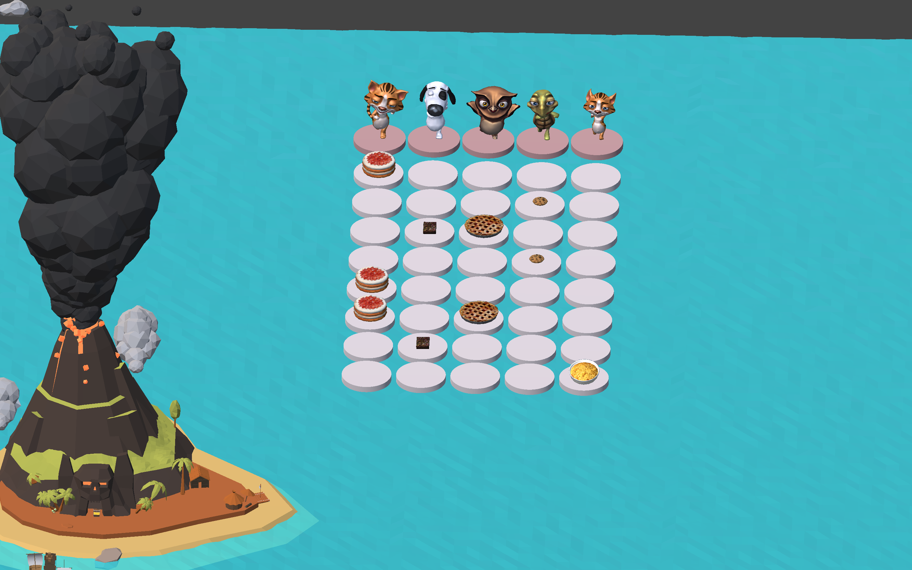

# Homework III


## Source code
[Go!](https://github.com/iooops/Go-)

## Videos
[Go! - Short Demo](https://youtu.be/iq1FXgt-NqI)


## Build 

Open Unity, then open the whole folder.<br>
File -> Build & Run<br>


## Run
### Usage:

````
Click on the round grid and add food.
Click Space to start. 
You could add the food on the run.
There will be animal sounds.
Click Space again to stop.
````

## My Musical Statement  
It's fairly simple.
**Just a sequencer with rigid timing.** Animal sounds are fun though.

## Screenshots



## Something I want to share

1. Unity is really a big machine.
2. Chunity is (kind of) easy to use.


<br>
Thanks to Jack Atherton(TA) and Ge Wang(Prof) for valuable advices and answers.